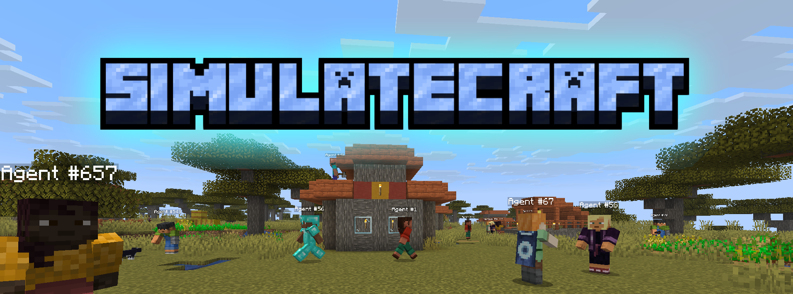

<p align="center">
  
</p>

<p align="center">
  <a href="https://github.com/DanyalAbbas/SimulateCraft/actions/workflows/ci.yml"></a>
  <a href="https://danyalabbas.github.io/SimulateCraft/"></a>
  <a href="LICENSE"></a>
</p>

LLM-powered agents that play Minecraft — live map, chat, and goals from your browser.

**Docs:** [https://danyalabbas.github.io/SimulateCraft/](https://danyalabbas.github.io/SimulateCraft/)

---

## Quick start

Needs **Git**, **Node.js 18+**, and (optional) **Docker Desktop**. Prefer [OpenRouter](https://openrouter.ai/keys) / [9Router](https://9router.com/) / your own API.

**Windows** (PowerShell):

```powershell
irm https://raw.githubusercontent.com/DanyalAbbas/SimulateCraft/main/install.ps1 | iex
# if 503: irm https://cdn.jsdelivr.net/gh/DanyalAbbas/SimulateCraft@main/install.ps1 | iex
```

**macOS / Linux:**

```bash
curl -fsSL https://raw.githubusercontent.com/DanyalAbbas/SimulateCraft/main/install.sh | bash
```

Then set a key in `~/SimulateCraft/.env` and run `.\run.ps1` or `./run.sh`.

- Viewer → [http://127.0.0.1:8000](http://127.0.0.1:8000)
- Minecraft Java **1.21.4** → `localhost`

---

## License

[MIT](LICENSE) · [Changelog](CHANGELOG.md)

<p align="center">
  <a href="https://github.com/DanyalAbbas"></a>
</p>
