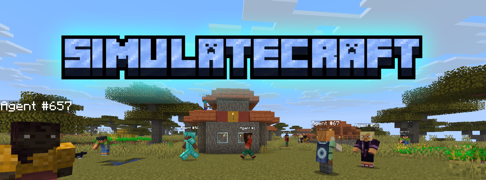

# SimulateCraft

**LLM agents that play Minecraft.**

You run a Minecraft server, SimulateCraft joins with one or more bots, an LLM
decides what each bot does each tick, and a browser UI lets you watch and steer
the simulation.

## Start here

| Tutorial | What you’ll do |
|---|---|
| [First run](getting-started.md) | Install deps, set a key, launch with `run.ps1` / `run.sh` |
| [Connect an LLM](llm-providers.md) | Groq, OpenRouter, or 9Router |
| [Use the live viewer](viewer.md) | Map, spawn agents, chat, pause / speed |
| [How it works](how-it-works.md) | Big picture of the tick loop (no API dump) |
| [Contributing](contributing.md) | Dev setup if you want to change the code |

Need a function signature later? See the [API reference](reference/index.md) at the end of the sidebar.

!!! tip "Fastest path"
    Get a free [Groq key](https://console.groq.com/keys), put it in `.env`, then:

    **Windows:** `.\run.ps1` (or double-click `run.cmd`)

    **macOS / Linux:** `./run.sh`

    Open [http://127.0.0.1:8000](http://127.0.0.1:8000) and join `localhost` in Minecraft **1.21.4**.
