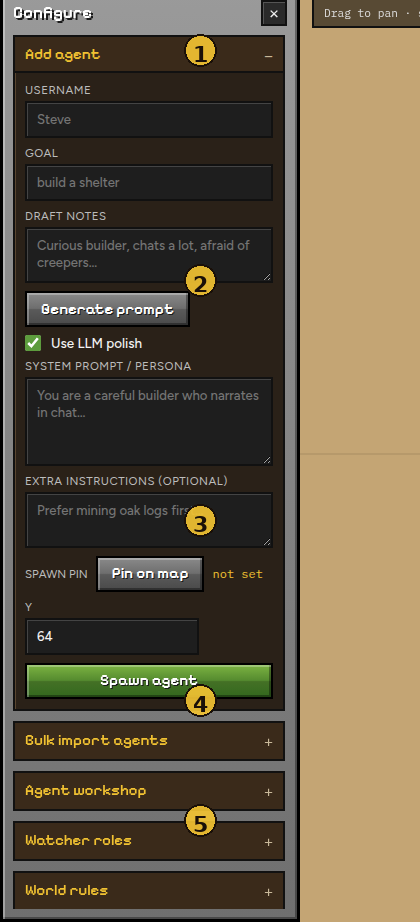

# Agents

Everything for creating and listing bots lives under **Configure** (left column). Agents join as survival Mineflayer bots — not OP / spectator.

| # | Section | Purpose |
|---|---|---|
| **1** | Configure header | Close with **×** (or **Config** in the top bar) |
| **2** | Add agent | Single-agent spawn form |
| **3** | Spawn controls | Pin on map, Y height, **Spawn agent** |
| **4** | More panels | Bulk import, workshop, watchers, world… |
| **5** | Players | Live roster of connected agents |

---

## Spawn one agent

1. Open **Add agent**.
2. Set **Username** (Minecraft name, max 16) and **Goal**.
3. Optional persona:
   - Write **Draft notes** → **Generate prompt** (template, or **Use LLM polish** if a key is set).
   - Or paste a full **System prompt / persona** yourself.
4. Optional spawn location:
   - Click **Pin on map** → click the map (marker appears).
   - Set **Y** (default 64; raise it on hills / roofs).
5. Click **Spawn agent**.

!!! tip "Pin each spawn"
    The pin sticks until you change it. If you spawn several agents without moving the pin, they all start at the **same** XZ. Re-pin (or clear with Esc and pin again) for different starts.

!!! note "Join lag"
    Spawning many bots in a row can hitch the Minecraft server. Existing agents briefly get resistance so they do not fall through unloaded chunks. Prefer pausing the sim while you mass-spawn.

---

## Bulk import

**Bulk import agents** accepts CSV / Excel / TSV.

1. Set column mapping under **Agent workshop** (or pick **University** / **Minimal** presets).
2. Choose a file → **Upload & spawn**.
3. Uses the current spawn pin (if set) for every row.

Personas are built from mapped fields. A `Persona` column is used as-is when present.

---

## Agent workshop

Persisted in `data/agent_workshop.json`:

| Setting | Effect |
|---|---|
| **Prompt generator instructions** | System prompt for **Generate prompt** |
| **Roster columns** | Which CSV/Excel headers map to name, traits, goal, persona, skin URL, … |
| **University / Minimal** | One-click column presets |

**Save workshop** writes to disk for the next run.

---

## Players list

The **Players** block under Configure shows each agent’s name and quick status. Count updates as bots join or leave. Remove agents from the roster UI when available, or via API.

Agents are also targetable in the [Chat](chat.md) dropdown once online.

Next: [World](world.md)
