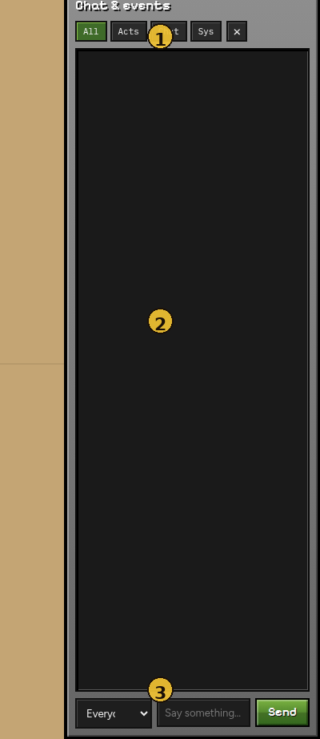

# Chat & events

The right rail is the live **event log** plus a composer to talk to agents.



| # | Element | Purpose |
|---|---|---|
| **1** | Title + filters | **All / Acts / Chat / Sys** — narrow the log |
| **2** | Event log | Tick-tagged lines (actions, chat, system) |
| **3** | Composer | Target dropdown + message + **Send** |

Hide the rail with **×** or the top-bar **Chat** toggle.

---

## Filters

| Filter | Shows |
|---|---|
| **All** | Everything |
| **Acts** | Agent actions (`navigate_to`, `mine_block`, …) |
| **Chat** | Spoken lines / chat events |
| **Sys** | Spawns, errors, control notices |

---

## Sending a message

1. Pick **Everyone** or one agent in the target dropdown.
2. Type a short message (max 256 chars).
3. **Send** — the line is queued as inbound human chat and appears on the next decide step for the target(s).

Pending human chat is visible to the LLM as part of the agent’s observation context.

---

## Reading the log

Each entry is roughly:

```text
t12  alex → navigate_to (3200ms)
```

- **Tick** — simulation step when it happened  
- **Agent** — who acted or spoke  
- **Kind** — action or chat  
- **Timing** — decision latency when relevant  

Use **Pause** + filters when an agent loops on the same action.

Next: [Watchers](watchers.md)
