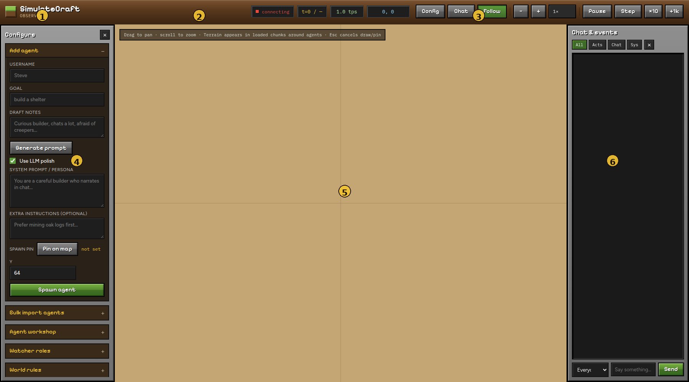

# Live viewer

After `./run.sh` or `.\run.ps1`, open [http://127.0.0.1:8000](http://127.0.0.1:8000).

The Observer is a three-column workspace: **Configure** (left), **Map** (center), **Chat & events** (right). Hide either sidebar with **×**, or use **Config** / **Chat** in the top bar.

| # | Region | What it does |
|---|---|---|
| **1** | Brand | SimulateCraft Observer |
| **2** | Run meta | Connection status, tick counter, tick rate, map-center coords |
| **3** | Controls | Sidebar toggles, Follow, speed, Play/Pause/Step |
| **4** | Configure | Agents, workshop, watchers, world rules / boundaries / import, roster |
| **5** | Map | Top-down world — drag to pan, scroll to zoom |
| **6** | Chat & events | Live log + send messages to agents |

---

## Guide pages

| Page | Start here if you want to… |
|---|---|
| [Map & controls](map.md) | Pan/zoom, Follow, play/pause, keys, preload terrain |
| [Agents](agents.md) | Spawn with a pin, generate prompts, bulk CSV, workshop |
| [World](world.md) | Rules, draw a square, build border, preload map, import |
| [Chat & log](chat.md) | Filter events, message one agent or everyone |
| [Watchers](watchers.md) | Join as a human and assign Spectator / OP / gamemode |

Deep world settings also live in [Worlds, boundaries & rules](../worlds.md).

---

## Quick start (2 minutes)

1. Open the viewer → wait until status shows **connected** / **running**.
2. **Configure → Add agent** → set username + goal.
3. Optional: **Pin on map**, set **Y**, then **Spawn agent**.
4. Use **Pause** / **Step** while you watch the map and chat log.
5. To fill blank map tiles: **Boundaries → Draw square → Preload map**.

!!! tip "Map tiles need visits"
    The map only shows chunks a bot has loaded. Empty parchment squares are normal until an agent (or **Preload map**) visits that area.

Next: [Map & controls](map.md)
