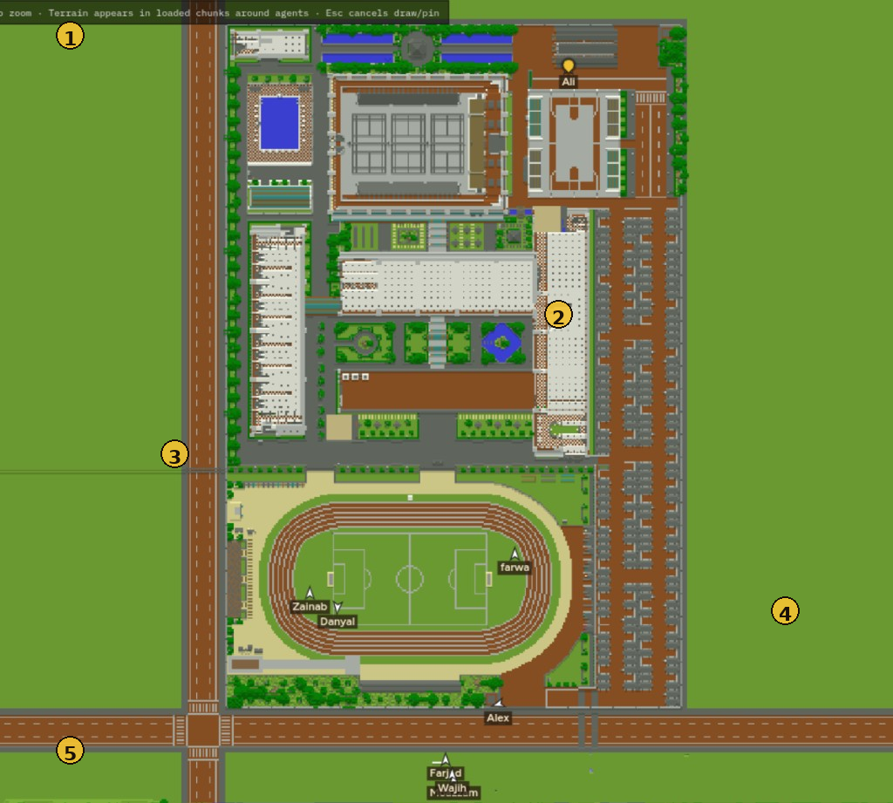
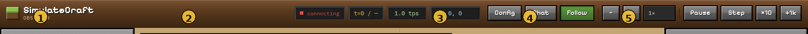
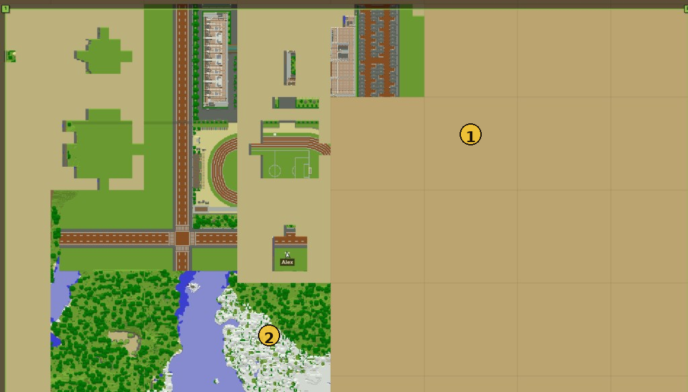

# Map & controls

The center column is a top-down **X/Z** map of the Minecraft world. Agents appear as labeled markers. Terrain fills in as chunks load around bots.



| # | Element | Notes |
|---|---|---|
| **1** | Map hint bar | Pan / zoom reminders; Esc cancels pin or square-draw |
| **2** | Loaded terrain | Blocks the bot has seen (surface colors) |
| **3** | Agent markers | Name + facing; Follow keeps them centered |
| **4** | Open / empty areas | May still be parchment until visited or preloaded |
| **5** | Roads / landmarks | Useful for pinning spawn points |

---

## Top bar



| # | Control | Effect |
|---|---|---|
| **1** | Brand | Observer identity |
| **2** | Status + tick + tps + coords | Connection state, `t=current / max`, tick rate, camera center |
| **3** | Config / Chat / Follow | Toggle sidebars; **Follow** centers the camera on agents |
| **4** | − / + / speed menu | Change ticks per second (or **Max**) |
| **5** | Pause · Step · ×10 · +1k | Freeze, advance while paused, raise max tick budget |

### Keyboard

| Key | Action |
|---|---|
| `Space` | Pause / resume |
| `.` | Step 1 tick |
| `Shift` + `.` | Step 10 ticks |
| `+` / `−` | Faster / slower |
| `F` | Toggle Follow |
| `Esc` | Cancel spawn pin or boundary draw |

---

## Moving the camera

- **Drag** the map to pan.
- **Scroll** to zoom (you can zoom far out when drawing a large preload square).
- **Follow** (on by default) tracks the agent centroid; turn it off to free-look.
- Pan range starts at `--map-radius` from home (default **512**). Preload can expand it.

```bash
uv run simulatecraft --map-radius 1024
```

---

## Why some tiles are blank



| # | Meaning |
|---|---|
| **1** | Tan / parchment tile — chunks not loaded for the scanning bot yet |
| **2** | Mixed coverage — retry / mop-up usually fills these |
| **3** | Agent standing on loaded terrain nearby |

**Fix:** draw a square over the area → **Configure → Boundaries → Preload map**. Scout bots load chunks; your agents stay put. Re-run Preload to mop up leftovers.

See [World → Preload map](world.md#preload-map).

---

## Simulation speed tips

- Use **Pause** + **Step** when debugging a single decision.
- High tps + many agents burns LLM quota quickly — start at **1×**.
- **+1k** only raises the *max tick budget*; it does not speed up time.

Next: [Agents](agents.md)
