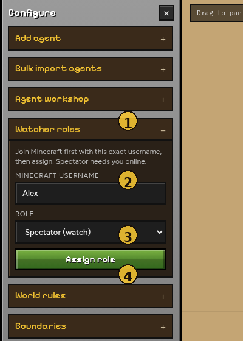

# Watchers (your Minecraft account)

**Watcher roles** apply to a *human* Minecraft username — not to agent bots. Use this to fly around in Spectator or take OP while agents run.

| # | Element | Purpose |
|---|---|---|
| **1** | Watcher roles | Open this panel under Configure |
| **2** | Minecraft username | Must match the name you used to join the server |
| **3** | Role | Spectator / OP / Survival / Creative / Adventure / Remove OP |
| **4** | Assign role | Sends the change over RCON |

---

## Steps

1. Join the bundled server (`localhost:25565`) with the **exact** username you will assign.
2. Open **Configure → Watcher roles**.
3. Enter that username.
4. Choose a role → **Assign role**.

| Role | Effect |
|---|---|
| **Spectator** | Watch without interacting (needs you online) |
| **OP** | Operator permissions |
| **Survival / Creative / Adventure** | Set gamemode |
| **Remove OP** | `deop` |

Assignment uses RCON on the Docker Minecraft container (`ENABLE_RCON=true`).

!!! note
    Agents spawned from the viewer are ordinary survival bots. Do not put agent names in Watcher roles unless you intend to change that bot’s gamemode / OP.

---

## Tips

- Spectator is best for filming or debugging pathing without bumping agents.
- If assign fails, check `docker compose logs` and that RCON password matches `.env` / compose (`simulatecraft` by default).
- After a world restart, re-join before assigning Spectator.

Back to [Viewer overview](index.md) · [How it works](../how-it-works.md)
