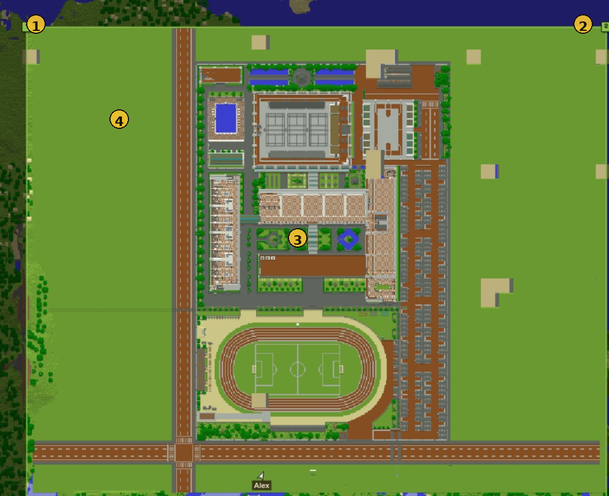

# World (rules, boundaries, preload, import)

World tools sit in **Configure**, below the agent panels. Full detail also lives in [Worlds, boundaries & rules](../worlds.md).

---

## World rules

**Configure → World rules → Apply rules** pushes gamerules / time over RCON.

| # | Element | Notes |
|---|---|---|
| **1** | World rules | Open this panel |
| **2** | Toggles | Night, cycles, weather, mobs, griefing, keep inventory, fire… |
| **3** | Day length / snap time | Custom day duration; optional one-shot `time set …` |
| **4** | Apply rules | Push to the Minecraft server via RCON |

| Setting | Effect |
|---|---|
| Allow night | Off → always daytime |
| Daylight cycle | Vanilla sun (forced off if night is disabled or custom day length is set) |
| Day length (minutes) | Custom full-day duration in real minutes |
| Snap time on apply | Optional one-shot `time set …` |
| Weather / clear weather | Matching gamerules + optional clear |
| Mob spawning | `doMobSpawning` |
| Hostile mobs | Off → `difficulty peaceful` (animals still OK if mob spawning is on) |
| Mob griefing / keep inventory / fire | Matching gamerules |

Settings persist in `data/world_settings.json` and re-apply when RCON is available.

---

## Boundaries (draw a square)

| # | Element | Notes |
|---|---|---|
| **1** | Enable play area | Soft/hard enforce + outside shading on the map |
| **2** | Draw square / Clear | Click two corners on the map (always snaps to a square) |
| **3** | Backup enforce | Soft (teleport back) / Hard (block navigate) / Off |
| **4** | Build border / Preload map | `worldborder` + optional scout-tile fill |

### Steps

1. Open **Boundaries**.
2. Check **Enable play area** if you want soft/hard enforce + outside shading.
3. **Draw square** → click one corner on the map (fixed), move, click again (always snaps to a square).
4. Choose backup **enforce**: Soft / Hard / Off.
5. **Build border** → applies vanilla `worldborder` to match the square.

**Esc** or **Clear** cancels the rubber-band.

Outside the square is shaded on the map when enabled. Soft/hard enforce use the same box as the worldborder.

---

## Preload map

Minecraft only streams chunks near players. The viewer cannot invent terrain for empty tiles.

| # | Meaning |
|---|---|
| **1** / **2** | Drawn-square corners |
| **3** | Filled terrain after preload |
| **4** | Occasional parchment gaps — re-run Preload / mop-up |

### Steps

1. Spawn at least one agent (needed so the environment is connected).
2. **Draw square** over the area you care about.
3. Click **Preload map**.
4. Wait for progress (`Preloading… n/m`, then optional **Filling gaps**).

Preload spawns temporary **scout** bots (up to 8), teleports *them* across the tile grid, then despawns them. **Your agents are not moved.**

| Cap | Value |
|---|---|
| Default max tiles | 512 (~2896×2896 at 128-block tiles) |
| Hard max | 1024 |

!!! warning "Large squares take time"
    Hundreds of tiles with settle + mop-up can take several minutes. Leave the tab open; preload continues even if the websocket briefly reconnects.

If blanks remain, run **Preload map** again on the same square.

---

## Import world

| # | Element | Notes |
|---|---|---|
| **1** | Import world | Open this panel |
| **2** | World .zip | Java world archive (must include `level.dat`) |
| **3** | Upload world | Writes into `data/minecraft/world` |
| **4** | Restart Minecraft | Reloads the Docker server with the new world |

1. Zip a Java world folder (must include `level.dat`).
2. **Import world** → upload the zip.
3. **Restart Minecraft** from the same panel (or `docker compose restart`).
4. Wait until the world finishes loading, then refresh agents.

See [Worlds](../worlds.md) for mount paths and troubleshooting.

Next: [Chat & log](chat.md)
