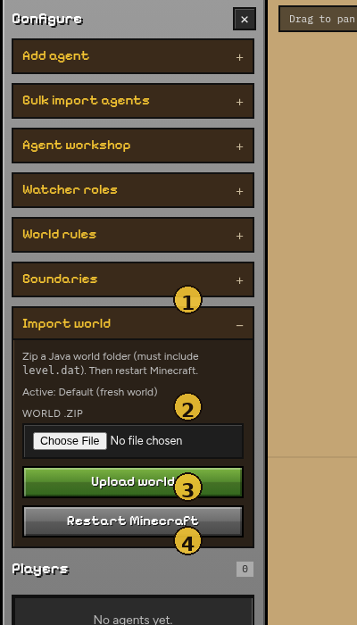
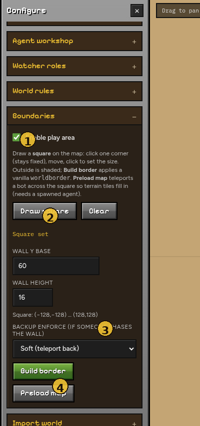
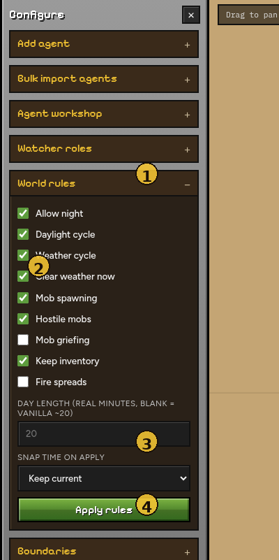

# Worlds, boundaries & rules

Import a custom Minecraft Java world, draw a square play area, and set
server rules (day/night, weather, griefing, …) from the **Configure** panel.

Annotated UI walkthrough: [Viewer → World](viewer/world.md).

## Import a world

| # | Element | Notes |
|---|---|---|
| **1** | Import world | Under Configure |
| **2** | World .zip | Must contain `level.dat` |
| **3** | Upload world | Installs into the data volume |
| **4** | Restart Minecraft | Required before agents reconnect |

1. In Minecraft, open your world folder (the one that contains `level.dat`,
   `region/`, `data/`, …).
2. Zip that folder so `level.dat` is findable inside the archive.
3. Either:
   - At launch: choose **Import** when prompted (or
     `./run.sh --world import --import-world ./myworld.zip`)
   - Or viewer → **Configure → Import world** → upload the `.zip`, then
     **Restart Minecraft**
4. If you skip import, a **random** world is generated (new seed each time).

Worlds live under `data/minecraft/world` (`./data/minecraft:/data` in Docker).

!!! warning
    Restarting replaces the live server session. Reconnect agents after the
    world finishes loading (`Done (` in `docker compose logs -f`).

## Boundaries (draw a square)

| # | Element | Notes |
|---|---|---|
| **1** | Enable play area | Outside shading + soft/hard enforce |
| **2** | Draw square / Clear | Two clicks on the map; always a square |
| **3** | Backup enforce | Soft / Hard / Off |
| **4** | Build border / Preload map | `worldborder` + optional terrain preload |

**Configure → Boundaries**:

1. Click **Draw square**
2. Click one corner on the map, move, then click the opposite corner
   (the rubber-band always snaps to a square)
3. Click **Build border**

Optional: **Preload map** spawns temporary scout bots (up to 8) and teleports
*them* across the square — your agents stay where they are. Sparse tiles get a
slower second pass. Cap is 512 tiles (~2896×2896 blocks). Re-run Preload on the
same square to mop up leftovers.

**Physical border:** Minecraft’s `worldborder` (a few RCON commands) matching
the drawn square. Soft/hard enforce and map outside-shading use the same box.

Backup enforce (if someone phases / before worldborder applies):

- **Soft** — teleport agents back inside the square
- **Hard** — reject navigate actions outside the square
- **Off** — worldborder only

Older per-block `barrier` fills are no longer used (too slow); leftover blocks
from an old build may need a manual clear or world reset.

## World rules

| # | Element | Notes |
|---|---|---|
| **1** | World rules | Open under Configure |
| **2** | Toggles | Night, weather, mobs, griefing, keep inventory… |
| **3** | Day length / snap time | Custom day duration; optional time snap |
| **4** | Apply rules | Push over RCON |

**Configure → World rules**:

| Setting | Effect |
|---|---|
| Allow night | Off → always daytime |
| Daylight cycle | Vanilla sun (forced off if night is disabled or custom day length is set) |
| Day length (minutes) | Custom full-day duration in real minutes |
| Snap time | Optional one-shot `time set …` on Apply |
| Weather / mobs / fire / keep inventory | Matching gamerules |
| Hostile mobs | Off → `difficulty peaceful` (no hostiles; animals still OK if mob spawning is on) |
| Mob spawning | Off → `doMobSpawning false` (no natural spawns at all) |

Settings persist in `data/world_settings.json` and re-apply on server start when
RCON is available.
